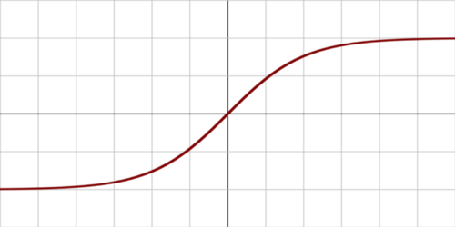
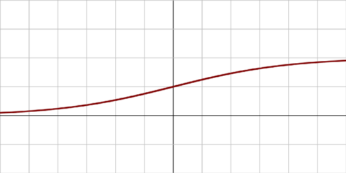
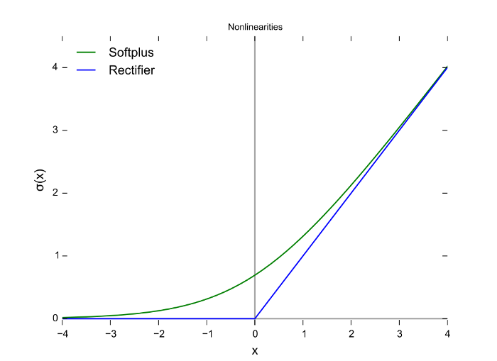

# 了解ReLU：深度学习中最受欢迎的激活函数！

神经网络和深度学习中的激活函数对处理隐藏节点产生更理想的输出起着重要作用。激活函数的主要目的是将非线性的特性引入模型中。

在人工神经网络中，一个节点的激活函数定义了给定输入或一组输入节点的输出。一个标准的集成电路可以看作是一个激活函数的数字网络，它可以根据输入 "开 "或 "关"。




图1. Sigmoid函数




图2. Tanh函数

Sigmoid和tanh是以前比较流行的激活函数。 然而，这些函数随着时间的推移会出现饱和，这就导致了梯度消失的问题。一个替代的、最流行的激活函数来克服这个问题，就是修正线性单元（`ReLU`）。




图3. ReLU和Softplus函数

上图中蓝色线条是修正线性单元（ReLU）的表示，而绿色线条是ReLU的变体，称为Softplus。ReLU的其他变体包括Leaky ReLU、ELU、SiLU等，这些变体在某些任务中被用于提高性能。

在本文中，我们将只考虑修正线性单元（ReLU），因为它仍然是执行大多数深度学习任务时默认使用最多的激活函数。它的变体通常用于特定用途，在这些用途中，它们可能比ReLU稍有优势。

这种激活函数是Hahnloser等人在2000年首次引入到动态网络中的，具有很强的生物学动机和数学依据。与2011年之前广泛使用的激活函数相比，它在2011年首次被证明能够更好地训练更深层次的网络，例如，对数sigmoid（它的灵感来自于概率论和逻辑回归）及其更实用的双曲正切函数。

截至2017年，修正器是深度神经网络最流行的激活函数。采用修正器的单元也被称为**修正线性单元**（**ReLU**）。

ReLU尽管是最好的激活函数之一，但在最近并不经常使用，主要原因是它在0点处不可微分。研究者倾向于使用sigmoid和tanh等可微分函数。然而，现在发现ReLU是深度学习的最佳激活函数。


图4. ReLU函数及对应的导函数

ReLU激活函数在除0点外的所有点都是可微分的，对于大于0的值，我们只考虑函数的最大值。可以写成：

```pseudocode
f(x) = max{0, z}
```

简单来说，也可以写成这样：

```pseudocode
if input > 0:
    return input
else:
    return 0
```

所有的负值都默认为0，正数的最大值也会被考虑在内。

对于神经网络的反向传播的计算，ReLU的分化是比较简单的。我们唯一会做的假设就是0点的导数，也会认为是0，这个通常不会有太大的顾虑，大部分情况下都能很好的解决。函数的导数是斜率的值。负值的斜率是0.0，正值的斜率是1.0。

ReLU激活函数的主要优点是：

**1. 卷积层和深度学习：** 它们是训练卷积层和深度学习模型最常用的激活函数。

**2. 计算简单：** 修正函数的实现非常简单，只需要一个max()函数。

**3. 表示稀疏性：** 修正函数的一个重要好处是它能够输出真正的零值。

**4. 线性行为：** 当神经网络的行为是线性或接近线性时，它更容易优化。

然而，修正线性单元的主要问题是，所有的负值都会立即变为零，这降低了模型从数据中正确拟合或训练的能力。

这意味着任何给ReLU激活函数的负值输入都会在图形中立即变成零，这反过来又会因为没有适当地映射负值而影响结果图形。然而，这可以通过使用ReLU激活函数的不同变体，如前文讨论的Leaky ReLU和其他函数来轻松解决。


# 结论:

这是一个简短的介绍，以了解修正线性单元及其在深度学习技术中的重要性，截至目前。它比所有其他激活函数更受欢迎，正如本文所解释的那样，有充分的理由。我强烈建议查看i相关参考资料，以了解更多关于这个概念的信息！


# 参考资料:

1. https://machinelearningmastery.com/rectified-linear-activation-function-for-deep-learning-neural-networks/

2. https://en.wikipedia.org/wiki/Activation_function

3. https://en.wikipedia.org/wiki/Rectifier_(neural_networks)

4. https://towardsdatascience.com/activation-functions-neural-networks-1cbd9f8d91d6
