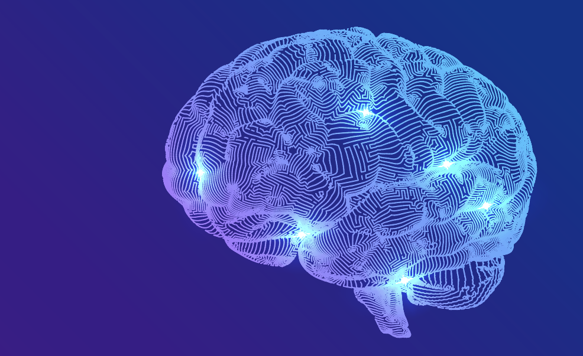
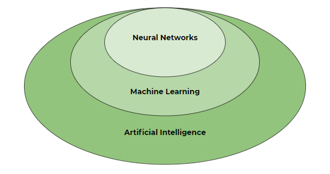
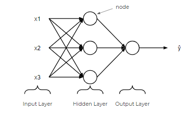
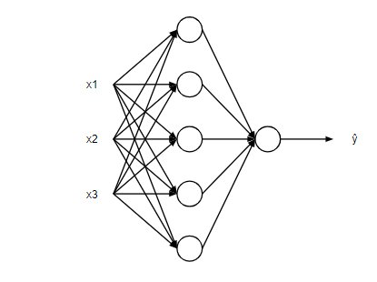
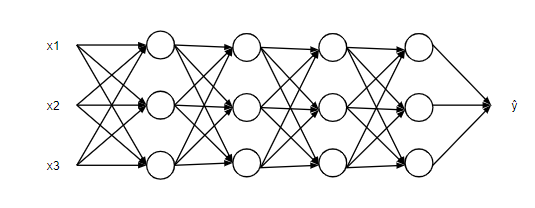
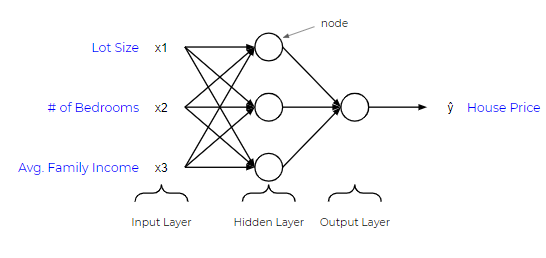
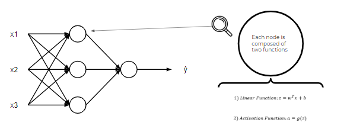
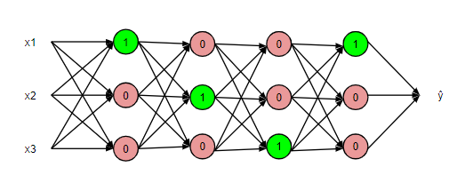

# 神经网络的初级解释

## 前言
当我开始学习神经网络时，我发现这样一个复杂的主题没有高质量的介绍信息。我经常读到神经网络是模仿大脑或具有类似大脑结构的算法，这对我来说一点帮助都没有。因此，本文旨在以一种任何人都能消化的方式来教授神经网络的基础知识，尤其是那些刚接触机器学习的人。

## 人工智能，机器学习和神经网络
在了解神经网络之前，我们需要先了解什么是人工智能和机器学习。

### 人工智能与机器学习

人工智能（AI）指的是让机器或软件有能力根据预定义的规则或模式识别模型做出自己的决策。模式识别模型的思想导致了机器学习模型，[机器学习模型](https://blog.datatron.com/all-machine-learning-models-explained-in-6-minutes/)是基于样本数据建立模型，对新数据进行预测的算法。注意，机器学习是人工智能的一个子集。

机器学习模型有很多，比如线性回归、支持向量机、随机森林，当然还有神经网络。现在我们又回到了最初的问题，什么是神经网络？

### 神经网络

在其根源上，神经网络本质上是一个数学方程网络。它接收一个或多个输入变量，通过方程网络，得出一个或多个输出变量。你也可以说，神经网络接受一个输入矢量，并返回一个输出矢量，但我在本文中不会涉及矩阵。

## 基本神经网络的机理

同样，我也不想太深究其中的机理，但值得向你展示一个基本神经网络的结构是怎样的。

在神经网络中，有一个输入层，一个或多个隐藏层，以及一个输出层。输入层由一个或多个特征变量（或输入变量或独立变量）组成，表示为x1，x2，...，xn。隐藏层由一个或多个隐藏节点或隐藏单元组成。一个节点简单来说就是上图中的一个圆圈。同样，输出变量也由一个或多个输出单元组成。

一个给定的层可以有很多节点，比如上图。

以及，一个给定的神经网络可以有很多层。一般来说，更多的节点和更多的层数可以让神经网络进行更复杂的计算。

上面是一个潜在神经网络的例子。它有三个输入变量，地段大小，卧室数量，和平均家庭收入。家庭收入。通过给这个神经网络输入这三个信息，它将返回一个输出，即房价。那么它到底是如何做到这一点的呢？

就像我一开始说的，神经网络不过是一个方程网络。神经网络中的每个节点都由两个函数组成，一个是线性函数，一个是激活函数。这就是事情可能会变得有点混乱的地方，但现在，把线性函数看作是一些最佳拟合线。另外，把激活函数看成是一个灯的开关，它的结果是在1或0之间的数字。

输入的特征（x）被输入到每个节点的线性函数中，结果是一个值，z。然后，z的值被输入到激活函数中，它决定了灯开关是否打开（在0和1之间）。

因此，每个节点最终决定了下面一层中哪些被激活，直到达到输出。从概念上来说，这就是神经网络的本质。

如果你想了解不同类型的激活函数，神经网络如何确定线性函数的参数，以及它的行为就像一个 "机器学习 "模型一样，可以自我学习，有专门关于神经网络的在线课程!

## 神经网络的类型

神经网络发展到现在，已经有好几种类型，但以下是三种主要类型。

### 人工神经网络（ANN）

人工神经网络(ANN)就像上面图片中的那样，它是由一组连接的节点组成的，这些节点接受一个输入或一组输入并返回一个输出。这是最基本的神经网络类型，如果你学习一门课程，你可能会学到。ANN由我们谈到的所有内容以及传播函数、学习率、成本函数和反向传播组成。

### 卷积神经网络（CNN）

卷积神经网络(CNN)使用的数学运算称为卷积。[维基百科](https://en.wikipedia.org/wiki/Convolution)将卷积定义为对两个函数的数学运算，产生第三个函数，表达一个函数的形状如何被另一个函数修改。因此，CNN在其至少一个层中使用卷积而不是一般的矩阵乘法。

### 循环神经网络（RNN）

回归神经网络(RNNs)是ANNs的一种类型，节点之间的连接沿着时间序列形成一个数字图，使它们能够利用内部存储器来处理可变长度的输入序列。由于这一特点，RNNs在处理序列数据方面非常出色，比如文本识别或音频识别。

## 神经网络的应用

神经网络是一种强大的算法，它带来了一些以前无法实现的革命性应用，包括但不限于以下内容。

- 图像和视频识别。因为有了图像识别能力，我们现在有了诸如安全的面部识别和Bixby视觉。

- 推荐系统。你想过Netflix是如何推荐你真正喜欢的节目和电影吗？他们很可能是利用了神经网络。

- 音频识别。如果你没有注意到，"OK Google "和Siri已经在理解我们的问题和我们说的话方面有了极大的提高。这种成功可以归功于神经网络。

- 自动驾驶。最后，我们在完善自动驾驶方面的进展 主要归功于人工智能和神经网络的进步。

## 总结

总结一下，主要有以下几点。

- 神经网络是机器学习模型的一种或机器学习的一个子集，机器学习是人工智能的一个子集。

- 神经网络是一个方程网络，它接受一个输入（或一组输入）并返回一个输出（或一组输出）。

- 神经网络由输入层、隐藏层、输出层和节点等各种组件组成。

- 每个节点由一个线性函数和一个激活函数组成，最终决定下一层的哪些节点得到激活。

- 神经网络有多种类型，如ANNs、CNNs和RNNs。

> `原文链接：`
> `https://blog.datatron.com/a-beginner-friendly-explanation-of-neural-networks/`
