# 2021年你应该了解的所有机器学习算法

> 最受欢迎的机器学习模型的直观解释！

随着我在机器学习方面的知识越来越多，机器学习算法的数量也越来越多！本文将介绍数据科学界常用的机器学习算法。

请记住，我对一些算法的阐述会比其他算法更多，只是因为如果我彻底解释每一种算法，这篇文章就会像一本书一样长! 我也会尽量减少本文中的数学量，因为我知道对于那些不精通数学的人来说，这可能是相当令人生畏的。取而代之的是，我将尝试对每个算法进行简明扼要的总结，并指出其中的一些关键特征。

考虑到这一点，我将从一些更基本的算法开始，然后深入到一些较新的算法，如CatBoost、Gradient Boost和XGBoost。

# 线性回归（Linear Regression）

线性回归是用于模拟因变量和一个或多个独立变量之间关系的最基本算法之一。简单来说，它涉及到寻找表示两个或多个变量的 "最佳拟合线"。

最佳拟合线是通过最小化点和最佳拟合线之间的平方距离来得到的，这就是所谓的最小化平方残差之和。残差简单来说等于预测值减去实际值。

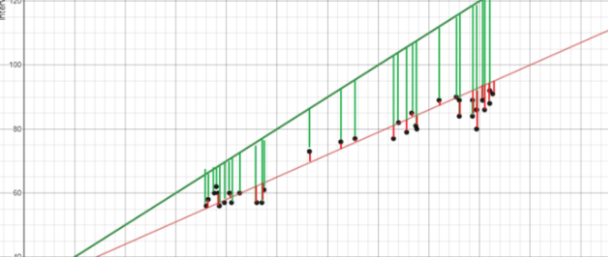

如果还不能理解，请考虑上面的图片。将最适合的绿线与红线进行比较，请注意，绿线的垂直线（残差）比红线大得多。这是有道理的，因为绿线离点太远了，根本不能很好地表示数据！这就是为什么绿线比红线大的原因。

更多线性回归背后的数学知识，请参考 Brilliant’s explanation(https://brilliant.org/wiki/linear-regression/#:~:text=Linear regression is a technique,a linear relationship between them.&text=The best-fitting linear relationship between the variables x and y.)。

# 逻辑回归（Logistic Regression）

逻辑回归类似于线性回归，但用于模拟离散值的概率，通常是二元的。逻辑回归听起来比线性回归复杂得多，但实际上只有一个额外的步骤。
$$
\begin{array}{c}
y=a x+b \\
y=\Theta^{T} X
\end{array}
$$
首先，你使用一个类似于线性回归的最佳拟合线方程来计算一个分数。

额外的一步是将你之前计算的分数输入到下面的sigmoid函数中，这样你就可以得到一个概率作为回报。这个概率就可以转换成二进制输出，要么是1，要么是0。
$$
S(x)=\frac{1}{1+e^{-x}}
$$
为了找到计算分数的初始方程的权重，一般会用到梯度下降或最大似然等方法。由于超出了本文的范围，这里不进行讲解。

# k近邻（K-Nearest Neighbors）

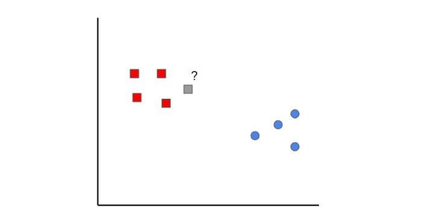

K近邻是一个简单的想法。首先，你从已经分类的数据（即红色和蓝色数据点）开始。然后，当你添加一个新的数据点时，你通过查看k个最近的分类点来对其进行分类。哪个类得到的票数最多，就决定了新点被归属为哪一类。

在本例中，如果我们设置k=1，我们可以看到离灰色样本最近的第一个点是一个红色数据点。因此，该点将被分类为红色。

需要注意的是，如果k的值设置的太低，可能会出现离群值。另一方面，如果k的值设置得太高，那么它可能会忽略只有几个样本的类别。

# 朴素贝叶斯（Naive Bayes）

朴素贝叶斯看起来是一个令人生畏的算法，因为它需要条件概率和贝叶斯定理的初步数学知识，但它是一个极其简单和 "朴素"的概念，我将尽力用一个例子来解释。

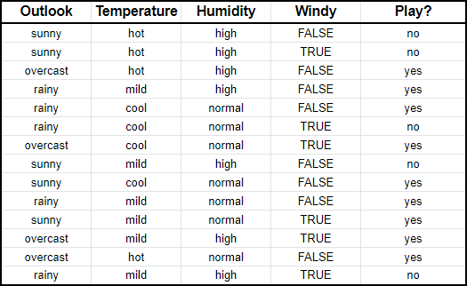

假设我们有关于天气特征的输入数据（`Outlook`前景，`Temperature`温度，`Humidity`湿度，`Windy`风力） 以及你是否打高尔夫（即最后一列`Play`）。

朴素贝叶斯本质上所做的是比较每个输入变量与输出变量中类别之间的比例。这可以在下面的表格中显示出来。

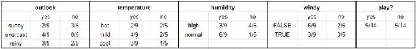

举个例子帮助大家理解，在**温度**部分，打高尔夫球的九天中有两天很热（即，`Yes`）。

用数学术语来说，你可以将其表示为**打高尔夫球时很热的概率**，数学符号是**P(hot|yes)**。这就是所谓的条件概率，对于理解我接下来要说的内容至关重要。

掌握了这些信息后，你就可以根据天气特征的任意组合预测是否要打高尔夫球。

设想一下，我们具有以下特征的新一天

- 前景： 晴天
- 温度：温和
- 湿度：正常
- 风力：无风

首先，我们要计算给定X的情况下，你会打高尔夫的概率，P(yes|X)，其次是给定X的情况下，你不会打高尔夫的概率，P(no|X)。

利用上图，我们可以得到以下信息。

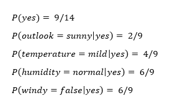

现在我们可以简单地将这些信息输入到下面的公式中。

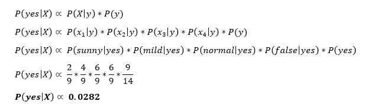

同样，你也会完成同样的步骤来计算P(no|X)。

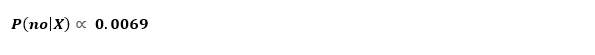

由于P(yes|X)>P(no|X)，那么你可以预测此人将会打高尔夫，因为前景是阳光明媚，温度温和，湿度正常，而且无风。

这就是朴素贝叶斯的精髓!

# 支持向量机（Support Vector Machines）

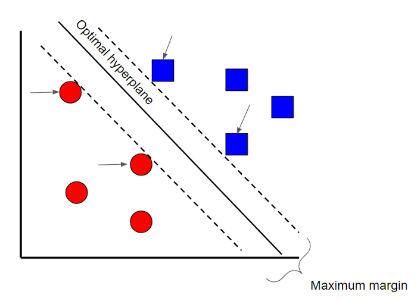

支持向量机是一种有监督的分类技术，它其实可以变得非常复杂，但在最基础的层面上是非常直观的。为了本文的需要，我们就把它保持在很高的水平上。

假设有两类数据。支持向量机将在两类数据之间找到一个**超平面**或边界，以使两类数据之间的余量最大化，即`Maximum margin`（见上图）。有很多平面可以将两类数据分开，但只有一个平面可以使两类数据之间的余量或距离最大化。

如果你想了解支持向量机背后的数学原理，可以参考这个【系列文章】(https://www.svm-tutorial.com/2014/11/svm-understanding-math-part-1/)。

# 决策树（Decision Tree）

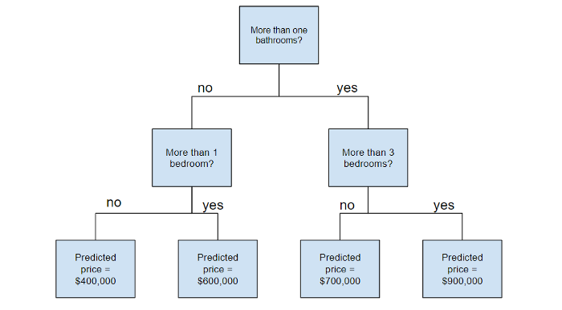

# 随机森林（Random Forest）

在了解随机森林之前，有几个术语你需要知道。

- **集合学习**是一种将多种学习算法结合使用的方法。这样做的目的是，它可以让你获得比单独使用一个算法本身更高的预测性能，形象地解释就是：三个臭皮匠，赛过诸葛亮！
- **`Bootstrap`采样**是一种使用随机采样与替换的重采样方法。听起来很复杂，但请相信我，我说它真的很简单——参考这个链接可以阅读更多关于`Bootstrap采样`的信息(https://towardsdatascience.com/what-is-bootstrap-sampling-in-machine-learning-and-why-is-it-important-a5bb90cbd89a)。
- **装袋`Bagging`：**当你使用`bootstrapped datasets`的集合来做决定时——我专门写了一篇文章来讨论这个话题，具体信息请参考这个链接(https://towardsdatascience.com/ensemble-learning-bagging-and-boosting-explained-in-3-minutes-2e6d2240ae21)。

现在你已经理解了这些术语，让我们深入了解一下。

随机森林是一种建立在决策树基础上的集成学习技术。随机森林涉及使用原始数据的自举数据集（`bootstrapped datasets`）创建多个决策树，并在决策树的每个步骤中随机选择变量的子集。然后，模型选择每个决策树的所有预测的模式（装袋，`bagging`）。这样做的目的是什么？通过依靠“多数胜利”模型，它降低了单个树出错的风险。

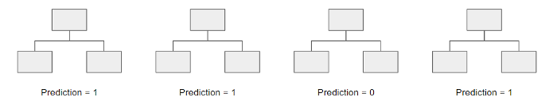

例如，如果我们创建了一棵决策树，即第三棵，它的预测值为0，但如果我们依靠所有4棵决策树的模式，预测值将为1。这就是随机森林的力量！

# 自适应提升（AdaBoost）

AdaBoost，即自适应提升，也是一种集成算法，利用`bagging`和`boosting`方法来开发增强的预测器。

AdaBoost与Random Forests的相似之处在于，预测来自许多决策树。但是，AdaBoost的独特之处在于以下三个主要区别：

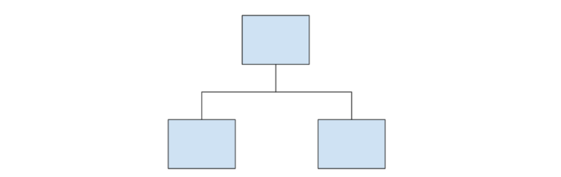

- 首先，AdaBoost创建了一个由树桩而非树木组成的森林。树桩是仅由一个节点和两片叶子组成的树（如上图所示）。
- 其次，创建的树桩在最终决策（最终预测）中的权重不同，产生更多错误的树桩在最终决定中的发言权会更小。
- 最后，树桩产生的顺序很重要，因为每个树桩的目的都是为了减少前一个树桩产生的错误。

从本质上讲，AdaBoost采取了一种更具迭代性的方法，即从以前的树桩所犯的错误中寻求迭代改进。

如果你想了解更多关于AdaBoost背后的数学原理，请参考这篇文章《5分钟内AdaBoost的数学解释》(https://towardsdatascience.com/a-mathematical-explanation-of-adaboost-4b0c20ce4382)。

# 梯度提升（Gradient Boost）

毫无疑问，**梯度提升（Gradient Boost）**也是一种使用`boosting`方法来提升预测器的集成算法。在很多方面，Gradient Boost与AdaBoost都十分相似，但有几个关键的区别：

- 与AdaBoost可以构建树桩不同，Gradient Boost通常可以构建具有8–32片叶子的树木。
- Gradient Boost将boosting问题看作是一个优化问题，它使用一个损失函数，并试图将误差最小化。这就是为什么它被称为**Gradient boost**，其灵感来自于梯度下降（`gradient descent`）。
- 最后，这些树用于预测样本的残差（即，预测值减去实际值）。

虽然最后一点可能会让人感到困惑，Gradient Boost首先要构建一棵树以尝试拟合数据，再构建随后的树以减少残差（错误）。它通过专注于现有学习者表现较差的区域来做到这一点，类似于AdaBoost。

# XGBoost

XGBoost是当今最流行、也是最为最广泛使用的集成学习算法之一，因为它实在是太强大了。XGBoost与Gradient Boost类似，但有一些附加功能，使其更为强大，包括：

- **叶子节点按比例缩小（修剪）** —— 用于提高模型的通用性。
- **Newton Boosting** —— 提供了一条直接通往最小值的路线，比梯度下降更快捷。
- **一个额外的随机化参数** —— 降低树与树之间的相关性，最终提高集成的强度。
- **对树进行特定的惩罚**。

我强烈建议你观看StatQuest的视频(https://www.youtube.com/watch?v=OtD8wVaFm6E&t=3s)，以更详细地了解XGBoost的工作原理！！！

# LightGBM

如果你认为XGBoost是最好的算法，请再考虑一下。 LightGBM是另一种提升算法，已被证实比XGBoost更快，有时甚至更准确。

LightGBM的不同之处在于它使用了一种独特的技术——基于梯度的单边采样（`GOSS`）来过滤掉数据实例，从而找到一个分裂值。这与XGBoost不同，XGBoost使用预排序（`pre-sorted`）和基于直方图（`histogram-based`）的算法来寻找最佳分割。

阅读更多关于`Light GBM`和`XGBoost`的内容，请参考(https://towardsdatascience.com/catboost-vs-light-gbm-vs-xgboost-5f93620723db)。

# CatBoost

CatBoost是另一种基于梯度下降的算法，它有一些微妙的差异，使其变得更独特：

- CatBoost实现了对称树，这有助于减少预测时间，而且它的默认树深度也比较浅（6个）。
- CatBoost利用随机组合的方式，类似于XGBoost的随机化参数。
- 然而，与XGBoost不同的是，CatBoost使用有序提升（`ordered boosting`）和响应编码（`response coding`）等概念，更优雅地处理分类特征。

总的来说，CatBoost之所以如此强大，是因为它对延迟的要求很低，这就意味着它比XGBoost快了将近八倍。

如果你想了解更多关于`CatBoost`的详细内容，请参考这篇文章(https://medium.com/@hanishsidhu/whats-so-special-about-catboost-335d64d754ae)。

`原文链接：https://towardsdatascience.com/all-machine-learning-algorithms-you-should-know-in-2021-2e357dd494c7`
