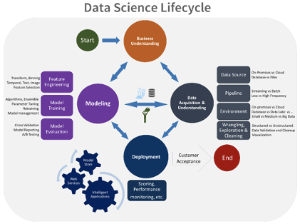

# Version Control for ML Models

## **What is Version Control?**

Version Control Systems are a classification of programming instruments that help a product team manage changes to source code over time. Version Control Systems monitor each alteration to the code in a unique sort of database. If a mix-up is made, engineers can compare earlier versions of the code to fix the slip-up while limiting disruption to all other colleagues working on the same project.

For any project, the source code is the most important asset, as it is an archive of the priceless information and comprehension about the problem domain that the engineers have gathered and refined through cautious efforts. Version control shields the source code from both calamity and the after-effects of human mistake and its unintended consequences.

## **Why Use Version Control?**

Version control frameworks allow you to look at records, identify the differences, and merge the changes if necessary, before committing any code. Versioning is additionally an extraordinary method to monitor application builds by having the option to recognize which adaptation is currently being developed, QA, and in production. Likewise, when new engineers join the team, they can easily download the present adaptation using the version control system and monitor the version presently running. During development, you can have independent code versions if you prefer to keep different development efforts separate. At the point when all the changes have been finalized, you can combine the documents to make a final working variant.

Version control also allows you to easily compare the different file versions, diminishing the time spent on recognizing the reason for an issue. In the unlikely event that the client does not approve the changes, you can execute the last working record by utilizing the correct version.

## **The Importance of Model Versioning**

If you’ve ever invested energy towards working with Machine Learning, one thing is clear: it’s an iterative procedure. There are various pieces of your model—how you utilize your information, hyper-parameters, parameters, calculation decision, design—and the ideal blend of those is the ultimate machine learning model, which can be obtained only after a series of trial and error events.

Here are some reasons why versioning is important to machine learning projects:

### **1. Finding the best model**

All through that iterative procedure of refreshing and tinkering with the various pieces of your model, your precision on your dataset will fluctuate in like manner. To monitor the best models you’ve made and the related tradeoffs, you have to have a data versioning system in practice.

### **2. Failure Tolerance**

When pushing new versions of models into products, they can fail for any number of reasons. You need to refresh your models to consider new data or increase the speed of the model, yet it’s hard to be certain how they’ll perform in real-time. In the unfortunate event that you do experience an issue with the production model, you should have the option to return quickly to the previous working version.

### **3. Increased Complexity and File Dependency**

With traditional software versioning, there are just two or three kinds of documents to monitor – your code, and your conditions. With machine learning, however, things are more unpredictable. First and foremost, you have datasets (commonly not part of normal software deployment). You have to monitor what information you train and test on, and if that changes after some time.

Moreover, models are frequently written in various languages and depend on numerous structures, which makes dependency tracking much more important.

### **4. Gradual, Staged Deployment**

If and when you make critical updates to your production model, those significant changes are rarely deployed immediately and in one go. To ensure failure tolerance and test appropriately, new models are typically rolled out step by step until teams can be certain that they’re working appropriately. Versioning gives you the tools to deploy the right model versions at the right time.

## **What is MLOps?**

[MLOps](https://blog.datatron.com/growth-mlops/) is the correspondence between data scientists and the operations or production team. It’s deeply collaborative, intended to dispose of waste, automates as much as possible, and produces more extravagant, increasingly reliable bits of knowledge with machine learning. Machine learning can be a distinct advantage for a business, yet without some type of systemization, it can be considered to be just a science experiment.

## **What Problems Will MLOps Solve?**

Operationalization assists in closing the gap between gaining insight and transforming that knowledge into actionable business value. Embracing an MLOps approach could help your business in the accompanying manners:

- Your operations team has the business idea, and your [data science team](https://blog.datatron.com/data-scientist-in-the-new-era/) squeezes the data to derive insights from it. In the middle? A wide bay of mismatched skill. MLOps joins the aptitude of both the teams for an efficient and accurate machine learning model that utilizes the skills of both teams.
- MLOps puts your operations team at the front line of new guidelines and best practices. They can take responsibility for versions while your data science team focuses on conveying inventive machine learning models.
- The bottleneck that results from confounded, non-instinctive algorithms facilitate a better division of skill and greater coordinated effort from the operations and data science team. MLOps ensures that the process is completed collaboratively and effectively.

Currently, [Datatron](https://www.datatron.com/) is the market leader as it supports different ML models, handles data from GB’s to TB’s, works across different cloud platforms, and allows you to migrate to different open-source alternatives. The platform aids in version control along with providing a variety of tools to ensure that your machine learning model is always up and running with features to ensure that the [model cycle](https://blog.datatron.com/walkthrough-of-ml-life-cycle/) is complete right from the development stage to the production stage. 

## **Conclusion**

Version Control acts as a time machine for your project. It can go back in time and bring back your project to the previous consistent state. With the help of an MLOps tool which acts as version control to bring back your machine learning model into the most consistent state ensuring you get the most accurate model using the least workforce possible.

https://blog.datatron.com/version-control-for-ml-models-with-code-algorithms-and-training-data-sets/
