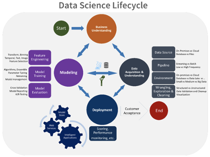

# 机器学习模型的版本控制

## **什么是版本控制？**

版本控制系统是编程工具的一种分类，它帮助产品团队管理随着时间的推移对源代码的修改。版本控制系统在一种独特的数据库中监控代码的每一次改动。如果发生了混改，工程师可以比较早期的代码版本来修复错误，同时限制对同一项目中所有其他同事的干扰。

对于任何项目来说，源代码都是最重要的资产，因为它是工程师们通过谨慎的努力收集和完善的关于问题领域的无价信息和理解力的档案。版本控制可以使源代码免受灾难和人为错误的后遗症及其意想不到的后果的影响。

## **为什么使用版本控制？**

版本控制框架允许你在提交任何代码之前查看记录，识别差异，并在必要时合并更改。版本控制是一个额外的非凡的方法来监控应用程序的构建，通过选项来识别当前正在开发、QA和生产中的适应性。同样，当新工程师加入团队时，他们可以很容易地使用版本控制系统下载当前的适配，并监控当前运行的版本。在开发过程中，如果你喜欢将不同的开发工作分开，你可以拥有独立的代码版本。当所有的修改都已完成时，你可以将这些文件合并起来，形成一个最终的工作变体。

版本控制还可以让你轻松比较不同的文件版本，减少识别问题原因的时间。在万一客户不同意更改的情况下，你可以利用正确的版本执行最后的工作记录。

## **模型版本化的重要性**

如果你曾经把精力投入到机器学习的工作中，有一点是很清楚的：这是一个迭代的过程。你的模型有不同的部分————如何利用你的信息、超参数、参数、计算决策、设计，而这些的理想融合就是最终的机器学习模型，只有经过一系列的试错事件才能得到。

以下是为什么版本控制对机器学习项目很重要的一些原因：

### **1. 寻找最好的模型**

在这个反复刷新和修整模型各部分的过程中，你对数据集的精度都会以同样的方式波动。为了监控你所做的最佳模型和相关的权衡，你必须在实践中拥有一个数据版本系统。

### **2. 容错能力**

当向产品中推送新版本的模型时，它们可能会因为任何原因而失败。你需要刷新模型以考虑新的数据或提高模型的速度，然而很难确定它们的实时性能如何。在不幸的情况下，你确实遇到了生产模型的问题，你应该可以选择快速返回到以前的工作版本。

### **3. 复杂性和文件依赖性增加**

在传统的软件版本管理中，只有两三种文档需要监控————你的代码和条件。然而，有了机器学习，事情就更加难以预料了。首先，你有数据集（通常不是正常软件部署的一部分）。你必须监控你训练和测试的信息是什么，以及一段时间后是否发生了变化。

此外，模型经常用各种语言编写，并依赖于众多的结构，这使得依赖性跟踪变得更加重要。

### **4. 逐步分阶段部署**

当你对生产模型进行关键更新时，这些重大的变化很少会立即一次性部署。为了确保故障容忍度和适当的测试，新的模型通常会一步步推出，直到团队可以确定它们的工作是适当的。版本化为您提供了在正确的时间部署正确的模型版本的工具。

## **什么是MLOps？**

[MLOps](https://blog.datatron.com/growth-mlops/) 是数据科学家和运营或生产团队之间的通信。它是深度协作的，尽可能地自动化，并通过机器学习产生更丰富、更可靠的知识。机器学习对企业来说可能是一个明显的优势，但是如果没有某种类型的系统化，它可以被认为只是一个科学实验。

## **MLOps将解决什么问题？**

可操作性有助于缩小获得洞察力和将这些知识转化为可操作的业务价值之间的差距。采用多种经营方式能够以相应的方式帮助你的企业：

- 你的运营团队有了商业想法，你的[数据科学团队](https://blog.datatron.com/data-scientist-in-the-new-era/)则对数据进行挤压，从中获得洞察力。在中间呢？ 一个技能不匹配的宽阔海湾。MLOps将两个团队的能力加入到一个高效准确的机器学习模型中，利用两个团队的技能。
- MLOps让你的运营团队处于新准则和最佳实践的第一线。他们可以负责版本，而你的数据科学团队则专注于传达创新的机器学习模型。
- 混淆的、非本能的算法所导致的瓶颈，有利于运营和数据科学团队更好地进行技能分工和更大程度的协调工作。MLOps确保了这个过程的协作和有效完成。

目前，[Datatron](https://www.datatron.com/)是市场的领导者，因为它支持不同的ML模型，处理从GB到TB的数据，在不同的云平台上工作，并允许你迁移到不同的开源替代品。该平台辅助版本控制，同时提供各种工具，以确保你的机器学习模型始终保持功能正常运行，确保[模型周期](https://blog.datatron.com/walkthrough-of-ml-life-cycle/)从开发阶段到生产阶段都是完整的！

## **结论**

版本控制就像你的项目的时间机器。它可以回到过去，让你的项目回到之前的一致状态。在MLOps工具的帮助下，它作为版本控制，将你的机器学习模型带回最一致的状态，确保你用最少的劳动力得到最准确的模型！

> `原文链接：`
> `https://blog.datatron.com/version-control-for-ml-models-with-code-algorithms-and-training-data-sets/`
